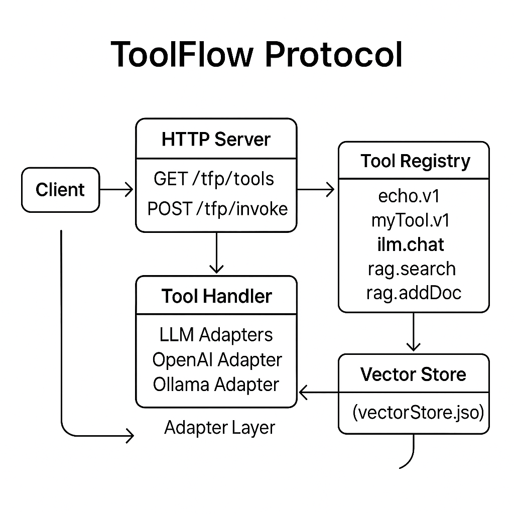

# ToolFlow Protocol (TFP) — YouTube Tutorial Branch

**This repo accompanies my YouTube series on ToolFlow Protocol — it’s **not** the official branch! For official updates, see [HiveForensics-AI/toolflow-tfp](https://github.com/HiveForensics-AI/toolflow-tfp).**

---

## What is This?

This is a teaching/demo version of the ToolFlow Protocol (TFP): a minimalist, JSON-first API framework for building context-aware tools (APIs) that work with LLM agents **or** humans.

I’ve simplified and annotated the code for **learning purposes** — perfect for following along with my tutorials!

---

## ⚠️ Disclaimer

* **NOT the official branch**: This repo is meant for YouTube viewers, experiments, and learning.
* **Production use?** Grab the [official repo here](https://github.com/HiveForensics-AI/toolflow-tfp) instead.

---

## 🗺️ Architecture Diagram



---

## 🚀 Features

* **Simple JSON protocol:** `/tfp/tools` for discovery, `/tfp/invoke` for tool calls
* **Type-safe:** Zod validation + full TypeScript types
* **LLM and RAG ready:** OpenAI, Ollama, and local vector-store RAG pipelines
* **Extensible:** Drop-in `registerTool()` for new handlers
* **Easy config:** `.env` for environment variables
* **CLI-friendly:** Works instantly with `curl` or any HTTP client

---

## 🏁 Quick Start

```bash
# 1️⃣ Clone this repo
git clone https://github.com/The3seus/ToolFlow-youtubecourse.git
cd ToolFlow-youtubecourse

# 2️⃣ Install dependencies
npm install

# 3️⃣ Setup environment variables
cp .env.example .env
# Then edit .env with your OpenAI key, Ollama base URL, etc.

# 4️⃣ Launch in dev mode (hot reload)
npm run dev
# → Open http://localhost:3000

# 5️⃣ Try out the API!
curl http://localhost:3000/tfp/tools

curl -X POST http://localhost:3000/tfp/invoke \
     -H "Content-Type: application/json"      \
     -d '{
           "toolId": "echo.v1",
           "input": { "text": "Hello from YouTube!" }
         }'
```

---

## 📁 Project Structure

```
.
├── .env.example           # Environment variable template
├── package.json           # Scripts & dependencies
├── tsconfig.json          # TypeScript config
├── README.md              # ← this file
└── src/
    ├── protocol/
    │   └── types.ts       # Zod schemas & types
    ├── tools/
    │   ├── echo.ts        # Example “echo.v1” tool
    │   ├── llmChat.ts     # LLM chat via OpenAI or Ollama
    │   └── ragSearch.ts   # RAG tool (vector store)
    ├── llm/
    │   ├── openaiAdapter.ts
    │   └── ollamaAdapter.ts
    ├── rag/
    │   └── vectorStore.ts
    ├── server.ts          # Express app with /tfp endpoints
    └── index.ts           # App bootstrap
```

---

## 🌱 Environment Setup

1. **Copy & edit environment variables:**

   ```bash
   cp .env.example .env
   # Fill in OpenAI API key, Ollama base URL, etc.
   ```

2. **Main .env fields:**

   ```
   OPENAI_API_KEY=sk-...
   OPENAI_MODEL=gpt-4o-mini
   OLLAMA_BASE_URL=http://localhost:11434
   OLLAMA_MODEL=llama3
   VECTOR_STORE_PATH=vectorStore.json
   PORT=3000
   ```

---

## 🤖 Built-in Tools (API Examples)

### `echo.v1` (demo tool)

```bash
curl -X POST http://localhost:3000/tfp/invoke \
  -H "Content-Type: application/json" \
  -d '{"toolId":"echo.v1","input":{"text":"Hello world"}}'
```

---

### `llm.chat` (OpenAI or Ollama LLM)

```bash
curl -X POST http://localhost:3000/tfp/invoke \
  -H "Content-Type: application/json" \
  -d '{"toolId":"llm.chat","input":{"prompt":"Say hi!","provider":"openai"}}'
```

or (with Ollama running locally):

```bash
curl -X POST http://localhost:3000/tfp/invoke \
  -H "Content-Type: application/json" \
  -d '{"toolId":"llm.chat","input":{"prompt":"Say hi!","provider":"ollama"}}'
```

---

### `rag.search` (vector search + LLM answer)

```bash
curl -X POST http://localhost:3000/tfp/invoke \
  -H "Content-Type: application/json" \
  -d '{"toolId":"rag.search","input":{"query":"What is TFP?","provider":"openai","topK":3}}'
```

---

### `rag.addDoc` (add docs to semantic search)

```bash
curl -X POST http://localhost:3000/tfp/invoke \
  -H "Content-Type: application/json" \
  -d '{
    "toolId": "rag.addDoc",
    "input": {
      "text": "ToolFlow Protocol (TFP) is a framework for tool-based AI agents.",
      "provider": "openai"
    }
  }'
```

* Docs are embedded and added to `vectorStore.json`.
* You can now retrieve them via `rag.search`!

---

## ➕ Add Your Own Tool

1. **Create** `src/tools/myTool.ts`:

   ```ts
   import { z } from 'zod';
   import { ToolDescriptor } from '../protocol/types';

   export const inputSchema = z.object({
     foo: z.string(),
     bar: z.number().optional()
   });
   export const outputSchema = z.object({
     result: z.string()
   });

   export const descriptor: ToolDescriptor = {
     toolId: 'myTool.v1',
     name: 'My Tool',
     description: 'Does something awesome.',
     version: '1.0.0',
     inputSchema,
     outputSchema,
     tags: ['example','demo']
   };

   export async function handler(input: z.infer<typeof inputSchema>) {
     return { result: `You sent foo=${input.foo}` };
   }
   ```

2. **Register** it in `src/server.ts`:

   ```ts
   import { descriptor as myDesc, handler as myHandler } from './tools/myTool';
   registerTool(myDesc, myHandler);
   ```

3. **Restart** the server. It will appear in `/tfp/tools`!

---

## 🔥 Error Handling

All responses use structured JSON, including errors:

* **Unknown tool:**

  ```json
  {
    "requestId": "...",
    "toolId": "nope.v1",
    "metadata": { "timestamp": "...", "status": "error" },
    "error": { "code": "ToolNotFound", "message": "Unknown tool" }
  }
  ```
* **Validation error:**

  ```json
  {
    "requestId": "...",
    "toolId": "echo.v1",
    "metadata": { "timestamp": "...", "status": "error" },
    "error": {
      "code": "ZodError",
      "message": "Expected string, received number at path: text"
    }
  }
  ```

---

## 🧪 Testing (with `curl` or Postman)

* **List tools:**
  `GET http://localhost:3000/tfp/tools`

* **Invoke a tool:**
  `POST http://localhost:3000/tfp/invoke`
  Header: `Content-Type: application/json`
  Body example:

  ```json
  {
    "toolId": "llm.chat",
    "input": { "prompt": "Hello!" }
  }
  ```

  `curl` command:

---

### 📰 `headline.generator.v1` — Generate Catchy Headlines

Create attention-grabbing headlines from any text!
Customize the **tone** for your use case—like `"energetic"`, `"professional"`, `"playful"`, and more.

**Example:**

```bash
curl --location 'http://localhost:3000/tfp/invoke' \
  --header 'Content-Type: application/json' \
  --data '{
    "toolId": "headline.generator.v1",
    "input": {
      "text": "Our new AI platform automates workflows and boosts productivity across teams.",
      "tone": "energetic"
    }
  }'
```

**Sample Response:**

```json
{
  "requestId": "...",
  "toolId": "headline.generator.v1",
  "output": {
    "headline": "Supercharge Your Team: Discover AI-Powered Productivity for Modern Workflows!"
  },
  "metadata": {
    "status": "success",
    "timestamp": "..."
  }
}
```

* **`text`**: The source content to summarize as a headline.
* **`tone`**: (Optional) Style for the headline, e.g., `energetic`, `professional`, etc.


---

## 🏗️ Building & Deployment

```bash
# Build production bundle
npm run build

# Start compiled server
npm start

# Or run in Docker (example)
docker build -t toolflow-tutorial:latest .
docker run -p 3000:3000 toolflow-tutorial:latest
```

---

## 🔬 Explore & Customize!

* Add new tools (see above)
* Swap out LLM adapters, add more vector stores, etc.
* Try building a simple front-end for `/tfp/tools` and `/tfp/invoke`

---

## 📜 License

Apache 2.0 — see [LICENSE](LICENSE)

---

**Happy hacking, and see you on YouTube! 🚀**

---

Let me know if you want a more “YouTube-personality” tone, or any extra tips/FAQ for your viewers!
